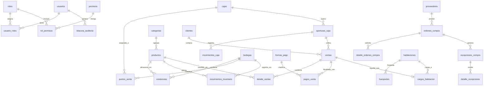

# Informe de Primer Avance: Sistema POS-ERP para Operación Hotelera
**Organización:** Hotel Puerto Limón  
**Proyecto:** Sistema POS-ERP Modular (Práctica Profesional)  
**Fecha:** Septiembre 2026  
**Documento base:** [Requerimientos práctica U.pdf](file:///c:/Users/chris/OneDrive/Escritorio/Proyecto/Requerimientos%20pr%C3%A1ctica%20U.pdf)

---

## 1. Resumen Ejecutivo del Primer Avance

Se ha alcanzado un **hito estable, modular y 100% funcional** que cubre la arquitectura base, el modelo de datos relacional completo, los módulos centrales del MVP, la interfaz gráfica de usuario y la verificación de los escenarios obligatorios de evaluación.

### Logros Principales de esta Etapa:
1. **Infraestructura de Desarrollo Configurada:**
   - Instalación y validación de Node.js v24.19.0 LTS, npm v11.17.0 y Git v2.55.0.
   - Despliegue de **PostgreSQL 16** local y autónomo (puerto 5432, base de datos `pos_erp_hotel`).
   - Repositorio Git inicializado con su commit base inicial y políticas de ignorado (`.gitignore`).
2. **Modelo de Base de Datos Relacional y Migraciones:**
   - 22 tablas relacionales diseñadas bajo estándares estrictos de integridad referencial, tipos monetarios decimales y borrado lógico.
   - Sembrado inicial (`seed.ts`) con 7 roles del sistema, permisos RBAC por módulo/acción, bodegas, cajas, catálogo de productos con existencias, clientes, proveedores, y habitaciones/huéspedes para pruebas de PMS.
3. **Backend API REST Modular (Node.js + Express + TypeScript):**
   - Autenticación segura mediante JWT y contraseñas cifradas con bcrypt (SEG-001).
   - Control de acceso RBAC verificado en el servidor para todas las rutas críticas (SEG-002).
   - Lógica de negocio para ventas atómicas, pagos mixtos, bloqueo por caja cerrada, Kardex inmutable, traslados, compras y conciliación hotelera.
   - Bitácora inmutable de auditoría para registro de acciones sensibles (SEG-003, SEG-004).
4. **Frontend SPA (React 18 + Vite + Tailwind CSS):**
   - Pantalla de inicio de sesión con botones de acceso rápido para demostración de cada rol.
   - Terminal de Punto de Venta (POS) ágil con catálogo interactivo, carrito y recibo imprimible.
   - Módulo de Caja y Arqueo con cálculo automático de sobrante y faltante.
   - Módulo de Inventario con alertas de stock bajo y visualización cronológica del Kardex.
   - Módulos operativos de Compras, Simulador PMS con prevención de duplicados (idempotencia), Reportes y Bitácora de Auditoría.
5. **Validación Exhaustiva:**
   - Los **10 escenarios obligatorios** de demostración (Sección 19 del documento) fueron probados exitosamente mediante script automatizado con 100% de aprobación.

---

## 2. Estructura General del Proyecto

El código fuente está estructurado bajo una arquitectura por capas desacoplada:

```
Proyecto/
├── Documentacion/
│   ├── INFORME_PRIMER_AVANCE.md        # Este informe detallado
│   └── Plan de Actividades.docx        # Plan de práctica profesional
├── Requerimientos práctica U.pdf        # Documento oficial de requerimientos
├── docker-compose.yml                  # Configuración de respaldo para contenedor PostgreSQL
├── start_servers.bat                   # Lanzador en un solo clic para Windows
├── start_servers.ps1                   # Lanzador para PowerShell
├── package.json                        # Scripts globales del proyecto
├── .gitignore                          # Exclusión de credenciales y dependencias
│
├── backend/                            # Capa de Lógica de Negocio y API REST
│   ├── prisma/
│   │   ├── schema.prisma               # Esquema oficial del modelo relacional
│   │   └── seed.ts                     # Sembrado de datos maestros, roles y usuarios
│   ├── src/
│   │   ├── config/
│   │   │   └── env.ts                  # Variables de entorno tipadas (.env)
│   │   ├── middleware/
│   │   │   ├── auth.middleware.ts       # Autenticación JWT y validación RBAC
│   │   │   └── error.middleware.ts      # Manejador centralizado de errores y logs
│   │   ├── modules/
│   │   │   ├── auth/                   # Login y perfil
│   │   │   ├── catalogos/              # Productos, categorías, clientes, bodegas
│   │   │   ├── caja/                   # Aperturas, arqueos y movimientos de efectivo
│   │   │   ├── ventas/                 # POS, pagos mixtos y anulación controlada
│   │   │   ├── inventario/             # Kardex inmutable, traslados y ajustes
│   │   │   ├── compras/                # Órdenes a proveedores y recepciones
│   │   │   ├── pms/                    # Capa desacoplada / simulador hotelero
│   │   │   ├── reportes/               # KPIs del día y exportación a CSV
│   │   │   └── auditoria/              # Consulta de bitácora inmutable
│   │   ├── utils/
│   │   │   ├── prisma.ts               # Cliente singleton de Prisma ORM
│   │   │   └── audit.ts                # Helper para registro inmutable de auditoría
│   │   ├── test-scenarios.ts           # Script de validación de los 10 escenarios
│   │   └── server.ts                   # Entrada del servidor Express (Puerto 4000)
│   ├── tsconfig.json
│   └── package.json
│
├── frontend/                           # Capa de Presentación (Single Page Application)
│   ├── src/
│   │   ├── api/
│   │   │   └── client.ts               # Cliente HTTP tipado contra la API
│   │   ├── components/
│   │   │   └── Navbar.tsx              # Navegación dinámica filtrada por rol
│   │   ├── context/
│   │   │   └── AuthContext.tsx         # Gestión de sesión, roles y permisos
│   │   ├── pages/
│   │   │   ├── Login.tsx               # Acceso con perfiles de prueba
│   │   │   ├── POS.tsx                 # Venta rápida, carrito y comprobante
│   │   │   ├── Caja.tsx                # Turnos, arqueo y sobrantes/faltantes
│   │   │   ├── Inventario.tsx          # Stock multibodega y Kardex
│   │   │   ├── Compras.tsx             # Órdenes y recepciones con factura
│   │   │   ├── PMS.tsx                 # Simulador hotelero con idempotencia
│   │   │   ├── Reportes.tsx            # Analítica y exportación Excel/CSV
│   │   │   └── Auditoria.tsx           # Bitácora de eventos sensibles
│   │   ├── App.tsx                     # Ruteo condicional por pestañas
│   │   ├── main.tsx
│   │   └── index.css                   # Estilos Tailwind CSS
│   ├── index.html
│   ├── vite.config.ts                  # Proxy inverso a http://localhost:4000
│   ├── tailwind.config.js
│   ├── tsconfig.json
│   └── package.json
│
└── docs/                               # Entregables técnicos formales
    ├── DOCUMENTACION_TECNICA.md
    ├── MANUAL_INSTALACION.md
    ├── MANUAL_USUARIO.md
    └── LISTA_VERIFICACION_ENTREGA.md
```

---

## 3. Estructura de la Base de Datos Relacional

### Parámetros del Motor de Persistencia
* **Motor:** PostgreSQL 16.8 (64-bit)
* **Host:** `127.0.0.1` | **Puerto:** `5432` | **Base:** `pos_erp_hotel`
* **Codificación:** UTF-8 | **Collate/Ctype:** Spanish_Mexico.1252
* **ORM:** Prisma ORM v5.22.0 con mapeo objeto-relacional tipado.

### Reglas de Negocio Implementadas en Datos:
1. **Tipos Decimales Exactos:** Ningún total monetario utiliza flotantes binarios (`Float`/`Double`). Se utiliza `@db.Decimal(12, 2)` para montos monetarios y `@db.Decimal(12, 3)` para cantidades de inventario, evitando discrepancias por redondeo (Sección 16).
2. **Integridad Referencial Estricta:** Todas las relaciones entre ventas, pagos, detalles, usuarios, bodegas y productos están gobernadas por claves foráneas (`FOREIGN KEY`) con restricciones coherentes (SEG-009).
3. **Inmutabilidad de Registros Críticos:** Los movimientos de caja y de inventario (Kardex) son inmutables; no se editan directamente. Cualquier corrección requiere una transacción compensatoria (ajuste positivo/negativo o reintegro por anulación).
4. **Borrado Lógico:** Los catálogos principales (productos, clientes, proveedores, bodegas, puntos de venta) incluyen la bandera `activo: Boolean` para preservar la integridad histórica (GEN-010).
5. **Auditoría Transaccional:** La tabla `bitacora_auditoria` almacena quién realizó cada acción sensible, qué entidad fue modificada, fecha/hora exacta, detalle previo/posterior e IP de origen (GEN-008, SEG-003).

---

## 4. Diagrama Entidad-Relación y Tablas



---

## 5. Diccionario Detallado de Tablas

### Módulo 1: Seguridad y Acceso (RBAC + Auditoría)
1. **`usuarios`**
   * `id` (String/CUID, PK): Identificador único interno.
   * `username` (String, Unique): Nombre de usuario único para inicio de sesión.
   * `passwordHash` (String): Contraseña cifrada con algoritmo bcrypt (mínimo 10 rondas de salt).
   * `nombre` (String): Nombre completo del empleado.
   * `email` (String, Unique): Correo electrónico institucional.
   * `activo` (Boolean, Default: true): Estado para borrado lógico.
   * `createdAt`, `updatedAt` (Timestamp): Marcas de tiempo de creación y modificación.

2. **`roles`**
   * `id` (String/CUID, PK)
   * `nombre` (String, Unique): Nombre técnico (`ADMINISTRADOR`, `CAJERO`, `RESTAURANTE_BAR`, `BODEGA`, `PROVEEDURIA`, `CONTABILIDAD`, `AUDITOR`).
   * `descripcion` (String, Opcional): Detalle de responsabilidades del perfil.
   * `activo` (Boolean, Default: true).

3. **`permisos`**
   * `id` (String/CUID, PK)
   * `modulo` (String): Módulo (`VENTAS`, `CAJA`, `INVENTARIO`, `COMPRAS`, `CLIENTES`, `PROVEEDORES`, `REPORTES`, `SEGURIDAD`, `HOTEL_PMS`).
   * `accion` (String): Acción autorizada (`VER`, `CREAR`, `EDITAR`, `ANULAR`, `DESCUENTO`, `AJUSTE`).
   * *Restricción Única:* `[modulo, accion]`.

4. **`usuario_roles`**
   * `id` (String/CUID, PK)
   * `userId` (String, FK -> `usuarios.id` ON DELETE CASCADE)
   * `roleId` (String, FK -> `roles.id` ON DELETE CASCADE)
   * *Restricción Única:* `[userId, roleId]`.

5. **`rol_permisos`**
   * `id` (String/CUID, PK)
   * `roleId` (String, FK -> `roles.id` ON DELETE CASCADE)
   * `permissionId` (String, FK -> `permisos.id` ON DELETE CASCADE)
   * *Restricción Única:* `[roleId, permissionId]`.

6. **`bitacora_auditoria`**
   * `id` (String/CUID, PK)
   * `userId` (String, FK -> `usuarios.id` ON DELETE SET NULL, Opcional): Usuario responsable.
   * `accion` (String): Código de la acción (`LOGIN`, `CREAR_VENTA`, `ANULAR_VENTA`, `CIERRE_CAJA`, `MOVIMIENTO_INVENTARIO`, etc.).
   * `entidad` (String): Nombre de la tabla afectada (`Sale`, `CashShift`, `InventoryMovement`, etc.).
   * `entidadId` (String, Opcional): ID del registro afectado.
   * `detalle` (Text, JSON): Payload con el detalle o cambios antes/después.
   * `ip` (String, Opcional): Dirección IP de la terminal que originó la petición.
   * `fecha` (Timestamp, Default: now()): Registro inmutable de tiempo.

---

### Módulo 2: Catálogos Maestros y Clientes
7. **`categorias`**
   * `id` (String/CUID, PK)
   * `nombre` (String, Unique): e.g. "Bebidas", "Alimentos", "Souvenirs".
   * `descripcion` (String, Opcional)
   * `activo` (Boolean, Default: true).

8. **`productos`**
   * `id` (String/CUID, PK)
   * `codigo` (String, Unique): Código de referencia comercial (e.g. "PRD-001").
   * `nombre` (String): Nombre descriptivo.
   * `descripcion` (String, Opcional)
   * `categoriaId` (String, FK -> `categorias.id`)
   * `precioVenta` (Decimal(12,2)): Precio final de venta.
   * `costo` (Decimal(12,2)): Costo promedio de adquisición.
   * `impuesto` (Decimal(5,2), Default: 13.00%): Porcentaje de IVA aplicable.
   * `codigoBarras` (String, Opcional): Código de barras para lector POS.
   * `esServicio` (Boolean, Default: false): Si es true, no descuenta existencias físicas.
   * `activo` (Boolean, Default: true).

9. **`clientes`**
   * `id` (String/CUID, PK)
   * `tipoIdentificacion` (String): `CEDULA_FISICA`, `CEDULA_JURIDICA`, `PASAPORTE`.
   * `identificacion` (String, Unique): Número de documento fiscal.
   * `nombre` (String): Razón social o nombre completo.
   * `email`, `telefono`, `direccion` (String, Opcionales)
   * `limiteCredito` (Decimal(12,2), Default: 0.00): Cupo de crédito autorizado.
   * `diasCredito` (Int, Default: 0): Plazo en días.
   * `creditoActivo` (Boolean, Default: false): Permiso explícito para ventas a crédito.
   * `activo` (Boolean, Default: true).

10. **`proveedores`**
    * `id` (String/CUID, PK)
    * `identificacion` (String, Unique): Cédula jurídica o tributaria del proveedor.
    * `nombre` (String): Nombre comercial.
    * `razonSocial` (String, Opcional)
    * `email`, `telefono`, `direccion` (String, Opcionales)
    * `diasCredito` (Int, Default: 0)
    * `activo` (Boolean, Default: true).

---

### Módulo 3: Cajas, Puntos de Venta y Turnos
11. **`cajas`**
    * `id` (String/CUID, PK)
    * `codigo` (String, Unique): e.g. "CAJA-01".
    * `nombre` (String): Nombre físico de la caja (e.g. "Caja Principal Recepción").
    * `ubicacion` (String, Opcional)
    * `activo` (Boolean, Default: true).

12. **`puntos_venta`**
    * `id` (String/CUID, PK)
    * `codigo` (String, Unique): e.g. "POS-01".
    * `nombre` (String): e.g. "POS Recepción y Souvenirs".
    * `departamento` (String): "RECEPCION", "RESTAURANTE", "BAR".
    * `cajaId` (String, FK -> `cajas.id`)
    * `bodegaDefectoId` (String, FK -> `bodegas.id`): Bodega de la cual se descarga stock al vender.
    * `activo` (Boolean, Default: true).

13. **`aperturas_caja`**
    * `id` (String/CUID, PK)
    * `cajaId` (String, FK -> `cajas.id`)
    * `usuarioId` (String, FK -> `usuarios.id`): Cajero responsable.
    * `fechaApertura` (Timestamp, Default: now())
    * `montoInicial` (Decimal(12,2)): Fondo inicial en efectivo entregado.
    * `fechaCierre` (Timestamp, Opcional): Fecha de cierre del arqueo.
    * `montoContado` (Decimal(12,2), Opcional): Dinero físico contado en gaveta.
    * `montoEsperado` (Decimal(12,2), Opcional): Fondo inicial + ventas efectivo + entradas - salidas.
    * `diferencia` (Decimal(12,2), Opcional): Monto contado - monto esperado (positivo = sobrante, negativo = faltante).
    * `estado` (String, Default: "ABIERTA"): `ABIERTA` o `CERRADA`.
    * `notas` (String, Opcional).

14. **`movimientos_caja`**
    * `id` (String/CUID, PK)
    * `cashShiftId` (String, FK -> `aperturas_caja.id`)
    * `usuarioId` (String, FK -> `usuarios.id`)
    * `tipo` (String): `ENTRADA_EXTRAORDINARIA` o `SALIDA_EXTRAORDINARIA`.
    * `monto` (Decimal(12,2))
    * `motivo` (String): Justificación obligatoria.
    * `fecha` (Timestamp, Default: now()).

---

### Módulo 4: Ventas y Formas de Pago
15. **`formas_pago`**
    * `id` (String/CUID, PK)
    * `codigo` (String, Unique): `EFECTIVO`, `TARJETA`, `SINPE_MOVIL`, `CREDITO`, `CARGO_HABITACION`.
    * `nombre` (String)
    * `activo` (Boolean, Default: true).

16. **`ventas`**
    * `id` (String/CUID, PK)
    * `consecutivo` (String, Unique): Consecutivo comercial secuencial (e.g. "VTA-000001").
    * `cashShiftId` (String, FK -> `aperturas_caja.id`)
    * `pointOfSaleId` (String, FK -> `puntos_venta.id`)
    * `usuarioId` (String, FK -> `usuarios.id`)
    * `customerId` (String, FK -> `clientes.id`, Opcional)
    * `subtotal` (Decimal(12,2))
    * `descuento` (Decimal(12,2), Default: 0.00)
    * `impuesto` (Decimal(12,2)): IVA calculado.
    * `total` (Decimal(12,2)): Total a cobrar.
    * `estado` (String, Default: "COMPLETADA"): `COMPLETADA`, `ANULADA`, `SUSPENDIDA`.
    * `motivoAnulacion` (String, Opcional)
    * `usuarioAnulacionId` (String, FK -> `usuarios.id`, Opcional)
    * `fechaAnulacion` (Timestamp, Opcional)
    * `notas` (String, Opcional)
    * `createdAt`, `updatedAt` (Timestamp).

17. **`detalle_ventas`**
    * `id` (String/CUID, PK)
    * `saleId` (String, FK -> `ventas.id` ON DELETE CASCADE)
    * `productId` (String, FK -> `productos.id`)
    * `cantidad` (Decimal(12,3))
    * `precioUnitario` (Decimal(12,2))
    * `descuento` (Decimal(12,2), Default: 0.00)
    * `subtotal` (Decimal(12,2))
    * `impuesto` (Decimal(12,2))
    * `total` (Decimal(12,2))
    * `notas` (String, Opcional).

18. **`pagos_venta`**
    * `id` (String/CUID, PK)
    * `saleId` (String, FK -> `ventas.id` ON DELETE CASCADE)
    * `paymentMethodId` (String, FK -> `formas_pago.id`)
    * `monto` (Decimal(12,2))
    * `referencia` (String, Opcional): Número de comprobante, voucher o voucher SINPE.
    * `createdAt` (Timestamp, Default: now()).

---

### Módulo 5: Inventarios Multibodega, Kardex y Traslados
19. **`bodegas`**
    * `id` (String/CUID, PK)
    * `codigo` (String, Unique): e.g. "BOD-01".
    * `nombre` (String): e.g. "Bodega Central Hotel".
    * `ubicacion` (String, Opcional)
    * `activo` (Boolean, Default: true).

20. **`existencias`**
    * `id` (String/CUID, PK)
    * `warehouseId` (String, FK -> `bodegas.id`)
    * `productId` (String, FK -> `productos.id`)
    * `cantidad` (Decimal(12,3), Default: 0.000)
    * `stockMinimo` (Decimal(12,3), Default: 0.000): Umbral de alerta.
    * `stockMaximo` (Decimal(12,3), Default: 1000.000)
    * *Restricción Única:* `[warehouseId, productId]`.

21. **`movimientos_inventario` (Kardex Inmutable)**
    * `id` (String/CUID, PK)
    * `warehouseId` (String, FK -> `bodegas.id`)
    * `productId` (String, FK -> `productos.id`)
    * `tipo` (String): `ENTRADA_COMPRA`, `SALIDA_VENTA`, `TRASLADO_ORIGEN`, `TRASLADO_DESTINO`, `AJUSTE_POSITIVO`, `AJUSTE_NEGATIVO`, `MERMA`.
    * `cantidad` (Decimal(12,3)): Cantidad del movimiento.
    * `saldoAnterior` (Decimal(12,3)): Existencia antes de la operación.
    * `saldoNuevo` (Decimal(12,3)): Existencia calculada tras la operación.
    * `costoUnitario` (Decimal(12,2))
    * `documentoReferencia` (String, Opcional): Consecutivo de venta, orden de compra o traslado.
    * `motivo` (String, Opcional)
    * `usuarioId` (String, FK -> `usuarios.id`)
    * `fecha` (Timestamp, Default: now()).

22. **`traslados_bodega` y `detalle_traslados`**
    * Cabecera con `consecutivo`, `warehouseOrigenId`, `warehouseDestinoId`, `usuarioId`, `estado` y líneas de detalle por producto y cantidad.

23. **`ajustes_inventario` y `detalle_ajustes`**
    * Registro de correcciones por merma, faltante o inventario físico con `consecutivo`, `warehouseId`, `tipo` (`POSITIVO`/`NEGATIVO`), `motivo` obligatorio y usuario autorizador.

---

### Módulo 6: Compras a Proveedores
24. **`ordenes_compra` y `detalle_ordenes_compra`**
    * Solicitud formal con `consecutivo` (e.g. "OC-000001"), `supplierId`, `warehouseId`, `usuarioId`, `estado` (`BORRADOR`, `APROBADA`, `RECIBIDA_PARCIAL`, `RECIBIDA_TOTAL`, `CANCELADA`) y totales.

25. **`recepciones_compra` y `detalle_recepciones`**
    * Registro de entrega con `consecutivo` ("REC-000001"), `purchaseOrderId`, `facturaProveedor`, bodega receptora y cantidades que incrementan el stock y Kardex en tiempo real.

---

### Módulo 7: Integración Hotelera / PMS
26. **`habitaciones`**
    * `id` (String/CUID, PK)
    * `numero` (String, Unique): e.g. "101", "102".
    * `tipo` (String): "ESTANDAR", "SUITE", "BUNGALOW".
    * `estado` (String, Default: "DISPONIBLE"): `DISPONIBLE`, `OCUPADA`, `MANTENIMIENTO`.
    * `activo` (Boolean, Default: true).

27. **`huespedes`**
    * `id` (String/CUID, PK)
    * `identificacion` (String, Unique)
    * `nombreCompleto` (String)
    * `habitacionId` (String, FK -> `habitaciones.id`)
    * `checkIn` (Timestamp, Default: now())
    * `checkOut` (Timestamp, Opcional)
    * `estado` (String, Default: "HOSPEDADO"): `HOSPEDADO`, `SALIO`.

28. **`cargos_habitacion`**
    * `id` (String/CUID, PK)
    * `saleId` (String, Unique, FK -> `ventas.id`)
    * `roomId` (String, FK -> `habitaciones.id`)
    * `guestId` (String, FK -> `huespedes.id`)
    * `monto` (Decimal(12,2))
    * `transaccionUuid` (String, Unique): **Token de idempotencia obligatorio (PMS-005)** para impedir que reintentos generen cobros repetidos.
    * `estadoPMS` (String, Default: "PENDIENTE"): `PENDIENTE`, `CONFIRMADO`, `ERROR`.
    * `reintentos` (Int, Default: 0)
    * `respuestaPMS` (Text, Opcional): Código de confirmación o error devuelto por la API del PMS.

29. **`cola_integracion_pms`**
    * Registro de intentos asíncronos y reintentos automáticos para cargos que hayan experimentado intermitencia de red.

---

## 6. Estado de los Procesos y Cómo Reanudar

Para garantizar que el sistema no consuma recursos en segundo plano mientras no lo estés utilizando, **todos los procesos de desarrollo han sido detenidos de forma limpia y segura**.

### Para Reanudar el Desarrollo en Cualquier Momento:

#### Opción A (Recomendada - Con un solo clic):
Haz doble clic en el archivo:
👉 **[start_servers.bat](file:///c:/Users/chris/OneDrive/Escritorio/Proyecto/start_servers.bat)**

Este archivo ejecutará automáticamente:
1. La verificación e inicio de PostgreSQL 16 local.
2. El servidor Backend en `http://localhost:4000`.
3. El servidor Frontend en `http://localhost:3000`.

#### Opción B (Desde la terminal):
```powershell
# 1. Iniciar PostgreSQL local:
& "C:\Users\chris\AppData\Local\Programs\pgsql\bin\pg_ctl.exe" -D "C:\Users\chris\AppData\Local\Programs\pgsql\data" start

# 2. Iniciar Backend:
cd backend
npm run dev

# 3. En otra terminal, iniciar Frontend:
cd frontend
npm run dev
```

---

## 7. Próximos Pasos Sugeridos para la Siguiente Sesión

Cuando desees retomar, podremos enfocarnos en cualquiera de los siguientes aspectos según tus prioridades:
1. **Pruebas de Usabilidad en el POS:** Simular un día completo de operación en recepción o bar (apertura de caja, cobro en efectivo/tarjeta, cargo a huéspedes y arqueo de turno).
2. **Personalización del Catálogo:** Cargar productos, categorías o menús reales del hotel con sus precios e imágenes.
3. **Impresión de Tickets:** Conectar formatos de tirilla térmica para impresoras de punto de venta (80mm / 58mm).
4. **Refinamiento de Pantallas o Reportes Contables:** Incorporar nuevos filtros o exportaciones adicionales a solicitud de tu tutor o empresa.
